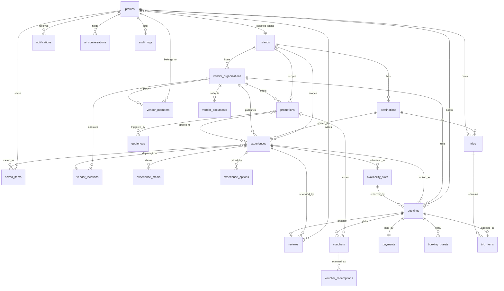

# Entity Relationship Summary

Initial ERD for the 24 entities required by [`PRD.md`](PRD.md) §12. Columns may be refined during
M1; relationships and permission boundaries may not be removed.

## Entity notes

### Identity & geography

| Entity | Key columns | Notes |
|---|---|---|
| `profiles` | `id` (= `auth.users.id`), `role`, `selected_island_id`, `selected_destination_id`, `interests[]`, `offer_consent`, `location_consent`, `currency`, `locale` | Role enum: `tourist`, `vendor_owner`, `vendor_staff`, `admin`, `super_admin`. One row per authenticated user; guests have no row (PRD §4, T-01). |
| `islands` | `code`, `name`, `in_app_brand`, `currency`, `timezone`, `hero_media`, `is_active` | `in_app_brand` carries "VIP Jamaica" etc. per PRD §3 — the app is never renamed. |
| `destinations` | `island_id`, `name`, `slug`, `centre_lat`, `centre_lng`, `editorial_content` | Jamaica seed: Ocho Rios, Montego Bay, Negril, Kingston, Port Antonio, South Coast. |

### Vendor

| Entity | Key columns | Notes |
|---|---|---|
| `vendor_organizations` | `island_id`, `legal_name`, `trading_name`, `status`, `verification_notes`, `subscription_plan_id`, `stripe_account_id` (null until Connect) | Status enum: `draft`, `pending_review`, `approved`, `changes_requested`, `rejected`, `suspended`. Only `approved` is public (V-02). |
| `vendor_members` | `vendor_org_id`, `user_id`, `role`, `permissions` | Basis of `is_vendor_member()` used by every vendor RLS policy. |
| `vendor_locations` | `vendor_org_id`, `name`, `lat`, `lng`, `address`, `operating_hours` | |
| `vendor_documents` | `vendor_org_id`, `kind`, `storage_path`, `review_state`, `reviewed_by` | Private bucket only; signed URLs (PRD §14). |

### Inventory

| Entity | Key columns | Notes |
|---|---|---|
| `experiences` | `vendor_org_id`, `island_id`, `destination_id`, `category`, `title`, `description`, `duration_minutes`, `inclusions[]`, `pickup_info`, `cancellation_policy_id`, `status`, `is_demo` | Status enum: `draft`, `pending_review`, `approved`, `unpublished`, `rejected`. `is_demo` satisfies operating rule 9. |
| `experience_media` | `experience_id`, `storage_path`, `sort_order`, `alt_text` | |
| `experience_options` | `experience_id`, `label`, `kind`, `unit_amount_minor`, `currency`, `min_guests`, `max_guests` | Kind: `adult`, `child`, `infant`, `addon`, `ticket_type`. |
| `availability_slots` | `experience_id`, `starts_at`, `ends_at`, `capacity`, `booked_count`, `status` | `booked_count <= capacity` enforced by CHECK **and** by `reserve_availability()` row lock (V-03). |

### Offers

| Entity | Key columns | Notes |
|---|---|---|
| `promotions` | `vendor_org_id`, `island_id`, `title`, `terms`, `value_kind`, `value_amount_minor`, `starts_at`, `ends_at`, `inventory_limit`, `issued_count`, `approval_state`, `requires_booking` | Demo seed: "Free rum punch with a qualifying booking". |
| `geofences` | `promotion_id`, `centre_lat`, `centre_lng`, `radius_m`, `active_days`, `active_window`, `cooldown_minutes`, `destination_id`, `vendor_location_id` | PRD §9 field list exactly. |

### Trips & booking

| Entity | Key columns | Notes |
|---|---|---|
| `saved_items` | `user_id`, `item_type`, `item_id` | Experiences and offers. |
| `trips` | `user_id`, `island_id`, `destination_id`, `starts_on`, `ends_on`, `title` | |
| `trip_items` | `trip_id`, `kind`, `booking_id`, `experience_id`, `scheduled_at`, `sort_order` | Kind: `booking`, `saved`, `itinerary_note`. Irie AI itineraries write here. |
| `bookings` | `user_id`, `vendor_org_id`, `experience_id`, `availability_slot_id`, `reference`, `status`, `subtotal_minor`, `tax_minor`, `service_fee_minor`, `discount_minor`, `total_minor`, `currency`, `commission_minor`, `idempotency_key` | Status: `pending_payment`, `confirmed`, `cancelled`, `completed`, `refunded`, `expired`. `reference` = human-readable `VIPJ-XXXX-XXXX`. Fee columns give V-07 gross/fee/net without recomputation. |
| `booking_guests` | `booking_id`, `experience_option_id`, `quantity`, `guest_name` | Guest details optional. |
| `payments` | `booking_id`, `provider`, `stripe_payment_intent_id`, `stripe_checkout_session_id`, `stripe_event_id` (**unique**), `status`, `amount_minor`, `refunded_minor` | Unique `stripe_event_id` is the webhook idempotency guarantee (T-05). Never stores card data. |

### Vouchers

| Entity | Key columns | Notes |
|---|---|---|
| `vouchers` | `token_hash` (**unique**), `booking_id`, `promotion_id`, `user_id`, `vendor_org_id`, `state`, `valid_from`, `valid_until` | State enum is PRD §9's eight states verbatim. Stores the hash, never the token (AD-04). |
| `voucher_redemptions` | `voucher_id`, `scanner_user_id`, `vendor_org_id`, `result`, `scanned_at`, `device_meta` | Append-only; no UPDATE/DELETE policy for anyone. Records failed scans too. |

### Platform

| Entity | Key columns | Notes |
|---|---|---|
| `notifications` | `user_id`, `kind`, `payload`, `sent_at`, `read_at` | |
| `reviews` | `booking_id` (**unique**), `experience_id`, `user_id`, `rating`, `body`, `moderation_state` | Unique booking ⇒ verified-booking reviews only. |
| `ai_conversations` | `user_id`, `session_id`, `messages`, `expires_at` | Minimal retention; user-clearable (PRD §14). |
| `audit_logs` | `actor_user_id`, `action`, `entity_type`, `entity_id`, `before`, `after`, `created_at` | Append-only. |
| `platform_settings` | `key`, `value` | Commission rate, service fee, tax rates, subscription plans. Makes PRD §10 config-driven. |
| `rate_limit_events` | `actor_key`, `action`, `created_at` | PRD §14 rate limiting. |
| `promotion_impressions` | `promotion_id`, `user_id`, `shown_at` | Geofence cooldown state (PRD §9). |

`platform_settings`, `rate_limit_events` and `promotion_impressions` are additions beyond the PRD's
24 — they implement §10's configuration-driven requirement and §9/§14's cooldown and rate-limit
requirements, which have no home in the listed entities.
